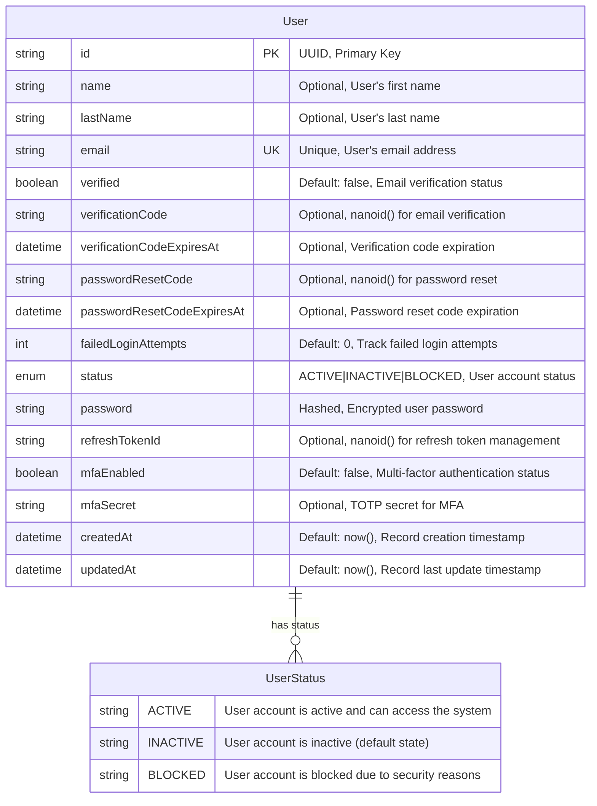

# Authentication API

This API provides endpoints for user management and authentication.

## Technology Stack

- TypeScript: programming language
- NodeJS: JavaScript runtime
- ExpressJS: Web framework
- PostgreSQL: database engine
- Docker: container system
- Prisma ORM: database entity management
- Zod: schema and type validation
- Resend: email service

## Folder Structure

```
src/
├── app.ts
├── domain/
│   ├── entities/
│   ├── errors/
│   ├── repositories/
│   └── use-cases/
├── infrastructure/
│   ├── data/
│   ├── repositories/
│   └── services/
├── presentation/
│   ├── controllers/
│   ├── middlewares/
│   ├── routes/
│   ├── schemas/
│   ├── templates/
│   └── server.ts
└── shared/
    ├── config.ts
    ├── email-templates.ts
    ├── encrypt.ts
    ├── jwt.ts
    └── properties.ts
```

## Data Model



## API Endpoints

### Authentication

| Method | URL             | Payload                                     |
| ------ | --------------- | ------------------------------------------- |
| POST   | `/auth/login`   | `{"email": "string", "password": "string"}` |
| POST   | `/auth/logout`  | -                                           |
| POST   | `/auth/refresh` | -                                           |
| GET    | `/auth/me`      | -                                           |

### Users

| Method | URL                                               | Payload                                                                                                          |
| ------ | ------------------------------------------------- | ---------------------------------------------------------------------------------------------------------------- |
| POST   | `/user/register`                                  | `{"email": "string", "password": "string", "confirmPassword": "string", "name": "string", "lastName": "string"}` |
| GET    | `/user/verify/:userId/:verificationCode`          | -                                                                                                                |
| POST   | `/user/forgot-password`                           | `{"email": "string"}`                                                                                            |
| POST   | `/user/reset-password/:userId/:passwordResetCode` | `{"password": "string", "confirmPassword": "string", "code": "string"}`                                          |

### Multi-Factor Authentication (MFA)

| Method | URL           | Payload               |
| ------ | ------------- | --------------------- |
| POST   | `/mfa/setup`  | -                     |
| POST   | `/mfa/verify` | `{"token": "string"}` |
| POST   | `/mfa/reset`  | -                     |
